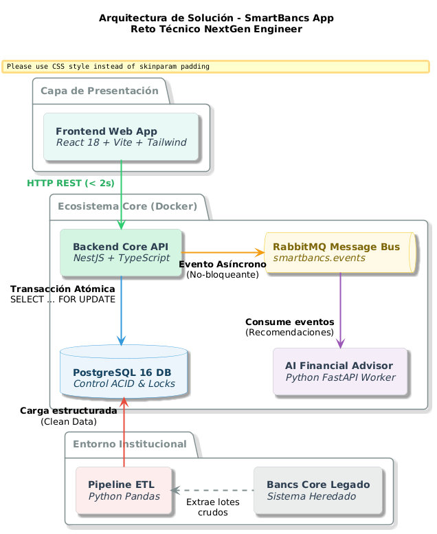

# 🚀 SmartBancs App — NextGen Engineering Technical Challenge

[](https://nestjs.com/)
[](https://react.dev/)
[](https://www.postgresql.org/)
[](https://www.rabbitmq.com/)
[](https://www.python.org/)
[](https://prometheus.io/)
[](https://www.docker.com/)

> Plataforma bancaria de alta concurrencia diseñada para procesar transacciones en tiempo real con cumplimiento **ACID**, recomendaciones financieras personalizadas impulsadas por **Inteligencia Artificial asíncrona**, integración con el **Core Legado "Bancs"** y observabilidad distribuida.

---

## 🏛️ 1. Arquitectura de la Solución

<p align="center">
  
</p>

---

## ⚡ 2. Características Principales

1. **Cumplimiento Estricto de SLA (< 2s):**
   - Transacciones procesadas en base de datos en ~15-20 ms.
   - Los eventos para la IA y para Bancs se guardan en un **Transactional Outbox** dentro de la misma transacción; un relay los publica en RabbitMQ fuera del camino crítico (sin *dual-write*: si el broker cae, los eventos no se pierden).
   - Header `Idempotency-Key`: un reintento del cliente nunca genera un doble débito.
2. **Prevención de Condiciones de Carrera (Race Conditions) y Deadlocks:**
   - Implementación de bloqueo pesimista ordenado (`SELECT ... FOR UPDATE`) ordenando lexicográficamente las cuentas antes de bloquear.
   - `lock_timeout` / `statement_timeout` por transacción, clasificación de errores por SQLSTATE (`40P01`, `55P03`, `57014`) y reintento con backoff ante deadlock.
   - Prueba de concurrencia automatizada contra PostgreSQL real (ver sección de pruebas).
3. **Integración con Core Legado (Bancs):**
   - *Transactional Outbox* implementado (tabla `outbox_events` + relay con `SKIP LOCKED`); el consumo hacia Bancs con Rate Limiting está diseñado en el documento técnico.
   - Script ETL en Python (`etl-bancs/etl_bancs_processor.py`) para limpieza, imputación de nulos y *feature engineering* de datos en crudo.
4. **Microservicio de Inteligencia Artificial:**
   - Motor de recomendaciones financieras (`ai-service`) con categorización de gastos, alertas de sobrecosto y scoring de inversión en segundo plano.
5. **Observabilidad Distribuida & Telemetría:**
   - Trazabilidad E2E mediante `x-correlation-id`.
   - Métricas de Prometheus (`/metrics`) que miden TPS, latencia (p50/p95/p99) y estados del pool de conexiones.
   - Dashboards visuales en Grafana.
6. **Simulador de Incidente de Quincena:**
   - Consola integrada para disparar ráfagas de 20 a 100 transacciones concurrentes y comprobar la estabilidad de conexiones y ausencia de bloqueos.

---

## 🚀 3. Instrucciones de Ejecución (Paso a Paso)

### Prerrequisitos
- [Docker Desktop](https://www.docker.com/) (con soporte para Docker Compose).

### Despliegue con un Solo Comando (IaC)
Clona el repositorio y ejecuta desde la raíz:

```bash
docker compose up --build
```

> Si ya habías levantado una versión anterior, recrea el volumen de la base para que se apliquen las tablas nuevas (`outbox_events`, `idempotency_key`): `docker compose down -v` y luego `docker compose up --build`.

### Detener la solución
```bash
docker compose down        # detiene los contenedores
docker compose down -v     # además borra los datos de PostgreSQL
```

### Pruebas
```bash
cd backend
npm install
npm test                   # pruebas unitarias
docker compose up -d postgres   # (desde la raíz) PostgreSQL para la prueba de integración
npm run test:int           # concurrencia contra PostgreSQL real
```
`npm run test:int` crea una base aislada `smartbancs_test` y verifica: 400 transferencias cruzadas en paralelo conservan el dinero total y no dejan saldos negativos; 50 débitos simultáneos de $10 sobre $100 aprueban exactamente 10; 20 reintentos con la misma `Idempotency-Key` debitan una sola vez; y con RabbitMQ caído los eventos quedan en el outbox y se publican al recuperarse.

### URLs de los Servicios Desplegados
| Servicio | URL Local | Credenciales / Info |
| :--- | :--- | :--- |
| **📱 Frontend Web App (React)** | [http://localhost:3000](http://localhost:3000) | Interfaz de Banca Digital |
| **⚡ Backend API Core (NestJS)** | [http://localhost:4000/api/v1/accounts](http://localhost:4000/api/v1/accounts) | API REST Transaccional |
| **📊 Métricas Prometheus** | [http://localhost:4000/metrics](http://localhost:4000/metrics) | Scrapeo de Telemetría |
| **🧠 Microservicio IA (FastAPI)** | [http://localhost:8000/docs](http://localhost:8000/docs) | Swagger del AI Advisor |
| **📬 RabbitMQ Management UI** | [http://localhost:15672](http://localhost:15672) | Usuario: `guest` / Clave: `guest` |
| **📈 Prometheus Server** | [http://localhost:9090](http://localhost:9090) | Servidor de Monitoreo |
| **📊 Grafana Dashboards** | [http://localhost:3001](http://localhost:3001) | Usuario: `admin` / Clave: `admin` |

---

## 🧪 4. Ejecución del Pipeline ETL (Core Bancs Legacy)

Para ejecutar la transformación del lote transaccional de Bancs manualmente:

```bash
cd etl-bancs
python etl_bancs_processor.py
```
El script generará el archivo `bancs_cleaned_features.json` con los datos limpios y variables predictivas para IA.

---

## 📂 5. Estructura del Repositorio

```
├── backend/                   # Microservicio Transaccional en NestJS + TypeORM
│   ├── src/
│   │   ├── modules/accounts/         # Gestión de cuentas y saldos
│   │   ├── modules/transactions/     # Lógica ACID con Pessimistic Locks
│   │   ├── modules/recommendations/  # Persistencia de IA insights
│   │   ├── modules/rabbitmq/         # Publicador de eventos asíncronos
│   │   ├── modules/simulation/       # Simulador de incidente de quincena
│   │   ├── common/logger/            # Winston Logger estructurado (JSON + CorrID)
│   │   └── common/metrics/           # Métricas Prometheus
│   ├── sql/                          # Scripts DDL y DML (Schema & Seed)
│   └── Dockerfile
├── frontend/                  # Aplicación Web React 18 + Vite + Tailwind CSS
│   ├── src/components/               # Componentes interactivos (Banca, IA, Operaciones, ETL)
│   └── Dockerfile
├── ai-service/                # Microservicio IA (Python FastAPI + RabbitMQ Consumer)
│   ├── main.py                       # API REST & Health
│   ├── advisor.py                    # Motor de inferencia y scoring
│   ├── consumer.py                   # Worker asíncrono
│   └── Dockerfile
├── etl-bancs/                 # Script de procesamiento ETL para Core Legado Bancs
│   ├── bancs_raw_transactions.csv   # Lote en crudo con anomalías
│   └── etl_bancs_processor.py        # Pipeline de limpieza y Feature Engineering
├── docker/                    # Configuraciones de observabilidad
│   ├── prometheus/                   # Configuración de scrapeo
│   └── grafana/                      # Datasources y Dashboards
├── docs/                      # Documentación Técnica Formal
│   ├── DOCUMENTO_TECNICO.md          # Arquitectura, Bancs, IA, Operaciones y Post-Mortem
│   └── AI_DISCLOSURE.md              # Declaración del uso de Inteligencia Artificial
└── docker-compose.yml         # Orquestación integral con un solo comando
```

---

## 📑 6. Documentación Adicional
- 📖 [Documento Técnico de Arquitectura y Operaciones](docs/DOCUMENTO_TECNICO.md)
- 🧠 [IA: implementación, despliegue y MLOps](docs/IA_IMPLEMENTACION_Y_DESPLIEGUE.md)
- 🔍 [Análisis de brechas contra la base de conocimiento](docs/ANALISIS_BRECHAS.md)
- 📚 [Base de conocimiento (bóveda Obsidian)](docs/knowledge-base/00-MOC.md) y [RAG local](tools/kb-rag/README.md)
- 🤖 [Declaración de Uso de Inteligencia Artificial](docs/AI_DISCLOSURE.md)
