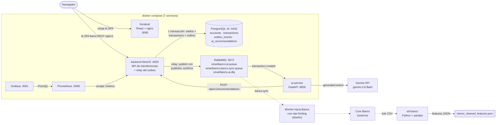

# SmartBancs App

[](https://github.com/kjramos5310/NextGEN_Ramos/actions/workflows/ci-cd.yml)

Prueba técnica TCS NextGen Engineer. SmartBancs es un MVP de plataforma de transferencias bancarias en tiempo real con tres piezas principales:

- **Transferencias ACID con concurrencia controlada.** Locks pesimistas en orden determinista, `lock_timeout`/`statement_timeout`, reintento ante deadlock, `Idempotency-Key` y montos exactos en `NUMERIC`.
- **Recomendaciones financieras con IA que no bloquean la transferencia.** Los eventos se guardan en un *Transactional Outbox* dentro de la misma transacción y un relay los publica en RabbitMQ con *publisher confirms*. El `ai-service` los consume y usa Gemini (`gemini-3.6-flash`) o, sin API key o si Gemini falla, un motor heurístico local.
- **Integración con el core legado "Bancs"**: un evento `bancs.sync` por transferencia en una cola durable (el worker con rate limiting está diseñado, no implementado) y un pipeline ETL en Python que limpia un lote crudo del core.

Además incluye observabilidad (logs con `x-correlation-id`, métricas Prometheus y un dashboard de Grafana) y una consola para simular el pico de quincena.

El enunciado está en [docs/reto/reto-original.md](docs/reto/reto-original.md).

## Arquitectura



Las líneas discontinuas son de diseño: la cola `bancs.sync` ya recibe un evento por transferencia, pero el worker que lo entregaría a Bancs no está implementado. El ETL es un script aparte que procesa un lote CSV del core. Los diagramas completos están en [docs/ARQUITECTURA_DIAGRAMAS.md](docs/ARQUITECTURA_DIAGRAMAS.md): secuencia de la transferencia, relay y DLQ, modelo de datos, Bancs y ETL, observabilidad y estados del outbox.

## Stack

| Pieza | Tecnología | Por qué |
|---|---|---|
| API transaccional | NestJS 10 + TypeORM (Node 20) | Módulos por dominio, validación declarativa de DTOs y control explícito de la transacción con `QueryRunner`. |
| Base de datos | PostgreSQL 16 | ACID, `SELECT ... FOR UPDATE`, `SKIP LOCKED` para el relay, `NUMERIC(18,2)` y `pg_stat_statements` para diagnosticar. |
| Mensajería | RabbitMQ 3.13 | Colas durables, *publisher confirms*, ack manual y dead-letter exchange. Suficiente para el volumen del MVP sin operar Kafka. |
| IA | Python 3.11 + FastAPI + pika | Servicio independiente del backend; si se cae, las transferencias siguen funcionando. |
| Modelo | Gemini `gemini-3.6-flash` + motor heurístico | Gemini es opcional: sin API key, o si falla, el motor de reglas responde. El motor usado queda en `metadata.engine`. |
| ETL | Python + pandas | Limpieza y *feature engineering* de un lote tabular con nulos, duplicados y formatos mixtos. |
| Frontend | React 18 + Vite + Tailwind, servido por nginx | SPA ligera para operar la demo: cuentas, transferencias, recomendaciones y consola de incidentes. |
| Observabilidad | winston, prom-client, Prometheus, Grafana | Logs con correlation ID (JSON en producción), métricas por SQLSTATE y dashboard provisionado. |
| Infraestructura | Docker Compose | Un comando levanta los 7 servicios, con healthchecks en PostgreSQL y RabbitMQ. |

## Prerrequisitos

- **Docker Desktop** (o Docker Engine con el plugin Compose). Es lo único necesario para levantar la solución.
- **Node.js 20 + npm**: solo para las pruebas del backend.
- **Python 3.11 o superior + pip**: solo para las pruebas del ai-service, el ETL y `check_gemini.py`.

## Configuración

```bash
cp .env.example .env
```

- `GEMINI_API_KEY` es **opcional**. Si queda vacía, el ai-service usa el motor heurístico local y todo el flujo funciona igual. Si la pones, compruébala antes de levantar:

  ```bash
  pip install -r ai-service/requirements.txt
  python ai-service/scripts/check_gemini.py
  ```

  El script hace una inferencia real con el código del servicio, dice si respondió Gemini o el motor heurístico y nunca imprime la clave.
- `docker compose` lee de `.env` solo `GEMINI_API_KEY` y `GEMINI_MODEL` (por defecto `gemini-3.6-flash`). El resto de variables de `.env.example` documenta los valores que el compose ya fija en `docker-compose.yml`.
- En `docker-compose.yml` el backend arranca con `SIMULATION_ENABLED: "true"` para la demo, lo que habilita `/api/v1/simulation`. Esos endpoints mueven saldos reales; fuera de una demo deben quedar en `false`.
- Las credenciales del compose (`postgrespassword`, `guest/guest`, `admin/admin`) son solo para uso local.

## Levantar

```bash
docker compose up --build
```

| Servicio | URL | Nota |
|---|---|---|
| Frontend | http://localhost:3000 | Banca digital, feed de IA, consola de incidentes y visor ETL |
| API del backend | http://localhost:4000/api/v1/accounts | REST; transferencias en `POST /api/v1/transactions` |
| Métricas del backend | http://localhost:4000/metrics | Formato Prometheus |
| ai-service | http://localhost:8000/docs | Swagger; estado en `/health` y `/model-info` |
| RabbitMQ Management | http://localhost:15672 | `guest` / `guest` |
| Prometheus | http://localhost:9090 | Scrapea el backend cada 5 s |
| Grafana | http://localhost:3001 | `admin` / `admin`; dashboard "SmartBancs - Core Metrics Overview" |
| PostgreSQL | `localhost:5432` | `postgres` / `postgrespassword`, base `smartbancs_db` |

## Probar una transferencia

Con el sistema levantado, las cuentas semilla ya existen (ver [Datos de prueba](#datos-de-prueba)).

```bash
# 1. Transferencia con Idempotency-Key: responde 201 con la transacción
curl -i -X POST http://localhost:4000/api/v1/transactions \
  -H 'Content-Type: application/json' \
  -H 'Idempotency-Key: demo-001' \
  -d '{"sourceAccountNumber":"1000000001","targetAccountNumber":"1000000002","amount":25.50}'

# 2. Mismo comando otra vez: devuelve la MISMA transacción (mismo id) y no debita de nuevo

# 3. Misma clave con otro monto: 422, porque es otro pago y no un reintento
curl -i -X POST http://localhost:4000/api/v1/transactions \
  -H 'Content-Type: application/json' \
  -H 'Idempotency-Key: demo-001' \
  -d '{"sourceAccountNumber":"1000000001","targetAccountNumber":"1000000002","amount":99}'

# 4. Monto con más de 2 decimales: 400
curl -i -X POST http://localhost:4000/api/v1/transactions \
  -H 'Content-Type: application/json' \
  -d '{"sourceAccountNumber":"1000000001","targetAccountNumber":"1000000002","amount":0.125}'

# 5. Saldos y recomendación generada por la IA (llega unos segundos después)
curl http://localhost:4000/api/v1/accounts/1000000001/balance
curl http://localhost:4000/api/v1/recommendations/account/1000000001

# 6. Métricas: transacciones, errores de BD por SQLSTATE, backlog del outbox y pool
curl -s http://localhost:4000/metrics | grep -E '^smartbancs_(transactions_total|db_errors_total|outbox_pending_events|db_pool_waiting_requests|ai_recommendation_duration_seconds_count)'
```

La respuesta lleva el header `x-correlation-id`. Con ese valor puedes seguir la operación en `docker compose logs backend ai-service`. La recomendación guarda en `metadata.engine` qué motor la generó (`gemini-3.6-flash` o `heuristic-fallback`).

En RabbitMQ Management (pestaña *Queues*) se ven `smartbancs.ai.queue`, su DLQ `smartbancs.ai.dlq` y `smartbancs.bancs.sync.queue`, que acumula mensajes porque no tiene consumidor.

## Pruebas

**Backend, unitarias** (31 pruebas, sin dependencias externas):

```bash
cd backend
npm ci
npm test
```

**Backend, integración** (12 pruebas contra un PostgreSQL real). Desde la raíz del repo:

```bash
docker compose up -d postgres
cd backend
npm run test:int
```

La prueba crea una base aislada `smartbancs_test`, aplica `sql/schema.sql` y usa el `TransactionsService` real. Verifica, entre otras cosas, que 400 transferencias cruzadas en paralelo conservan el total sin saldos negativos, que 50 débitos simultáneos de $10 sobre $100 aprueban exactamente 10, que 20 reintentos con la misma `Idempotency-Key` debitan una sola vez, que la misma clave con otro payload da 422, que 300 transferencias de centavos conservan el total, que el pool agotado responde 503 con `POOL_TIMEOUT` y que el relay solo marca `published_at` en los eventos confirmados. El broker de RabbitMQ se sustituye por un stub en estas pruebas. Se conecta a `localhost:5432` con `postgres`/`postgrespassword`; se puede cambiar con `TEST_DB_HOST`, `TEST_DB_PORT`, `TEST_DB_USER` y `TEST_DB_PASSWORD`.

**ai-service** (16 pruebas; sin red: no llama a Gemini ni a RabbitMQ):

```bash
cd ai-service
pip install -r requirements.txt -r requirements-dev.txt
pytest
```

Cubren el consumidor (ack solo con 2xx o 409, reintentos del POST, nack hacia la DLQ, trazabilidad en los logs), el contrato de colas con el backend, el fallback heurístico ante errores de Gemini y `/model-info`.

## ETL del core Bancs

```bash
cd etl-bancs
pip install -r requirements.txt
python etl_bancs_processor.py
```

Lee `bancs_raw_transactions.csv` (12 registros) y regenera `bancs_cleaned_features.json` (9 registros válidos). El pipeline elimina duplicados, descarta montos nulos y registros sin cuenta origen, normaliza fechas y moneda, mapea códigos a categorías y agrega variables para la IA (`isHighValue`, `logAmount`, `channelRiskScore`). El ETL no escribe en la base de datos. El visor ETL del frontend muestra una muestra de ejemplo fija en el código; no lee este JSON.

## Datos de prueba

| Datos | Dónde | Contenido |
|---|---|---|
| Cuentas semilla | [backend/sql/seed.sql](backend/sql/seed.sql) | 5 cuentas USD activas, `1000000001` a `1000000005`, con saldos entre 3 200 y 290 000. Se cargan al crear el volumen de PostgreSQL. |
| Lote crudo de Bancs | [etl-bancs/bancs_raw_transactions.csv](etl-bancs/bancs_raw_transactions.csv) | 12 registros con duplicado, nulos, montos con símbolos y fechas en formatos mixtos. |
| Salida del ETL | [etl-bancs/bancs_cleaned_features.json](etl-bancs/bancs_cleaned_features.json) | 9 registros limpios con variables para IA y metadatos de calidad. El script lo regenera. |
| Pruebas de integración | [backend/test/concurrency.int-spec.ts](backend/test/concurrency.int-spec.ts) | Cuentas creadas por cada prueba en la base `smartbancs_test` (se trunca entre escenarios). |
| Pruebas del ai-service | [ai-service/tests/test_consumer.py](ai-service/tests/test_consumer.py) | Mensajes AMQP y respuestas HTTP simuladas. |
| Simulación de quincena | `POST /api/v1/simulation/quincena-spike` | De 1.000 a 10.000 transferencias concurrentes entre las cuentas semilla (`totalRequests` ≤ 10.000, `concurrentWorkers` ≤ 200, 50 por defecto). Devuelve TPS medidos, p95 y la suma de saldos antes y después. No genera recomendaciones de IA. Requiere `SIMULATION_ENABLED=true`. |

## Despliegue en Google Cloud

Además del entorno local, la solución se despliega en Google Cloud con **Terraform** y un pipeline de **GitHub Actions**:
- Cloud Run para backend, ai-service y frontend, más un job de migración.
- Cloud SQL (PostgreSQL 16).
- RabbitMQ en una VM privada.
- Secret Manager para las credenciales.
- Workload Identity Federation para que GitHub se autentique sin llaves.

El pipeline corre las pruebas en cada push y pull request, y despliega en cada push a `main`. Los pasos están en [infra/README.md](infra/README.md).

## Detener

```bash
docker compose down        # detiene y elimina los contenedores
docker compose down -v     # además borra el volumen de PostgreSQL (vuelve a cargar schema y seed)
```

Si levantaste una versión anterior del proyecto, usa `docker compose down -v` antes de `docker compose up --build`. Los scripts de `backend/sql` solo se ejecutan al crear el volumen, así que con un volumen viejo faltan las tablas nuevas (`outbox_events`, la columna `idempotency_key`). Además, si RabbitMQ conserva la cola `smartbancs.ai.queue` declarada sin los argumentos de la DLQ, rechaza la nueva declaración con `PRECONDITION_FAILED`; `down -v` también elimina los volúmenes anónimos del contenedor de RabbitMQ y con ellos esa cola.

## Estructura del repositorio

```
├── backend/                     API transaccional (NestJS + TypeORM)
│   ├── src/modules/
│   │   ├── transactions/        transferencias ACID, idempotencia, reintentos
│   │   ├── outbox/              relay del Transactional Outbox
│   │   ├── rabbitmq/            conexión con confirms, reconexión y topología (DLX/DLQ)
│   │   ├── recommendations/     persistencia idempotente de recomendaciones de IA
│   │   ├── accounts/            cuentas y saldos
│   │   └── simulation/          pico de quincena y db-diagnostics (SIMULATION_ENABLED)
│   ├── src/common/              logger, métricas, correlation ID, validación
│   ├── sql/                     00-observability.sql, schema.sql, seed.sql, job de migración
│   └── test/                    pruebas de integración contra PostgreSQL
├── ai-service/                  FastAPI + consumidor RabbitMQ + motor Gemini/heurístico
│   ├── scripts/check_gemini.py  verificación de la API key
│   └── tests/                   pytest
├── etl-bancs/                   ETL del lote crudo de Bancs
├── frontend/                    React 18 + Vite + Tailwind
├── docker/                      configuración de Prometheus y Grafana
├── infra/terraform/             Google Cloud: Cloud Run, Cloud SQL, RabbitMQ, secretos, WIF
├── .github/workflows/ci-cd.yml  pruebas + build + despliegue
├── docs/
│   ├── DOCUMENTO_TECNICO.md
│   ├── IA_IMPLEMENTACION_Y_DESPLIEGUE.md
│   ├── ARQUITECTURA_DIAGRAMAS.md
│   ├── ANALISIS_BRECHAS.md
│   ├── AI_DISCLOSURE.md
│   ├── revision/                informes de la segunda revisión con agentes
│   ├── knowledge-base/          bóveda Obsidian (requisitos y referencias)
│   ├── proceso/bitacora.md
│   └── reto/reto-original.md    enunciado
├── tools/kb-rag/                RAG local sobre la bóveda
├── AGENTS.md, CLAUDE.md         instrucciones dadas a los agentes de código
├── .env.example
└── docker-compose.yml
```

## Documentación

- [Documento técnico](docs/DOCUMENTO_TECNICO.md): arquitectura, integración con Bancs, IA, observabilidad, incidente y post mortem.
- [IA: implementación, despliegue y MLOps](docs/IA_IMPLEMENTACION_Y_DESPLIEGUE.md)
- [Diagramas de arquitectura](docs/ARQUITECTURA_DIAGRAMAS.md)
- [Análisis de brechas](docs/ANALISIS_BRECHAS.md)
- [Segunda revisión con equipo de agentes](docs/revision/README.md)
- [Declaración de uso de IA](docs/AI_DISCLOSURE.md)
- [Base de conocimiento](docs/knowledge-base/00-MOC.md) y [RAG local](tools/kb-rag/README.md)
- [Bitácora del proceso](docs/proceso/bitacora.md)
