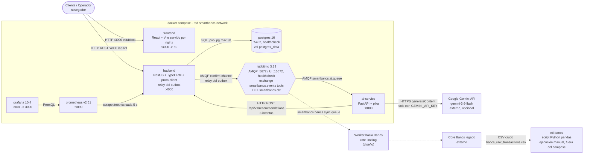
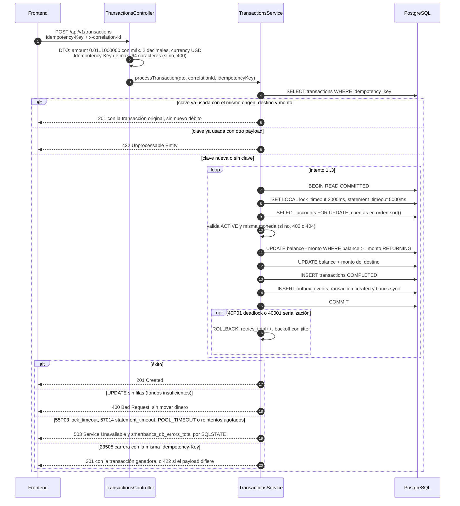
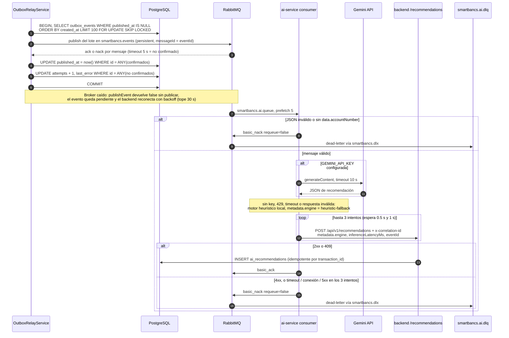
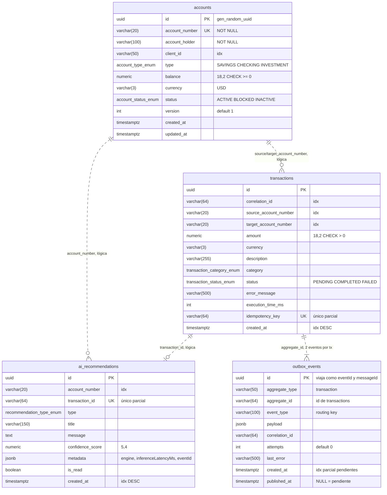
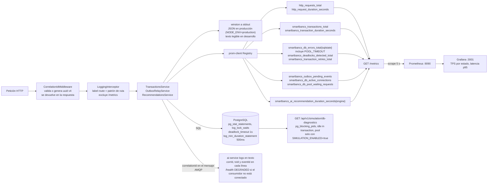
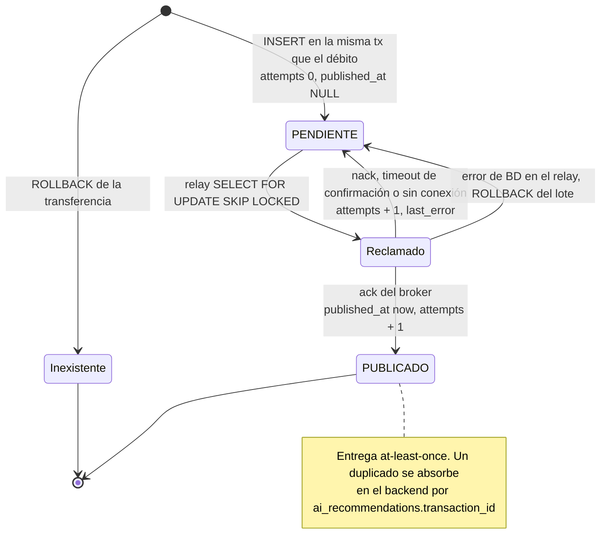
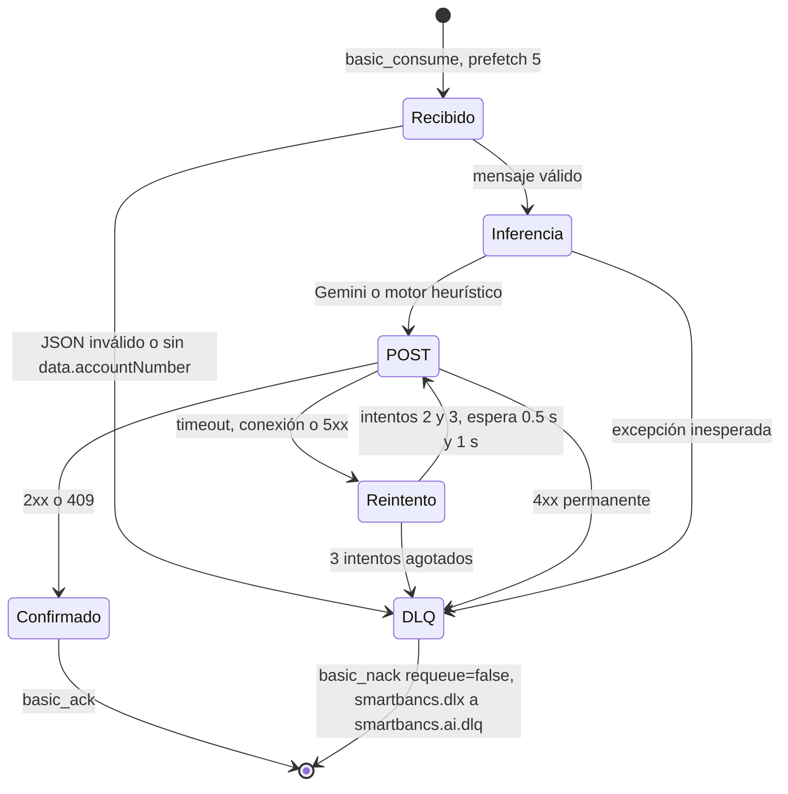
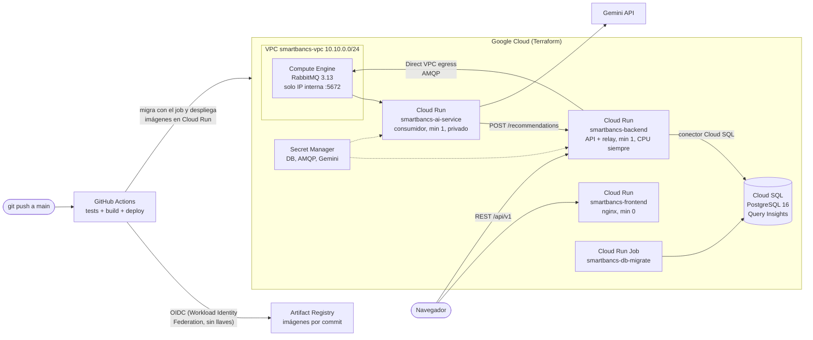

# SmartBancs App - Diagramas de arquitectura

Diagramas derivados del código fuente, no de la documentación. Reflejan el estado del repositorio después de la ronda de correcciones de la segunda revisión ([docs/revision/](revision/README.md)).

Convención: lo marcado como **(diseño)** no existe en el código del MVP; solo está descrito en [DOCUMENTO_TECNICO.md](DOCUMENTO_TECNICO.md). Todo lo demás se verificó en `docker-compose.yml`, `backend/src`, `backend/sql`, `ai-service`, `etl-bancs`, `frontend/src/services/api.ts` y `docker/`.

Los bloques Mermaid se validaron con `mermaid-cli` (`mmdc`): los ocho renderizan sin errores.

## 1. Vista de contenedores (C4 nivel 2)

Siete contenedores definidos en `docker-compose.yml` sobre la red `smartbancs-network`. El navegador llama directamente al backend en `:4000`: el nginx del frontend solo sirve estáticos y no hace proxy de `/api`. PostgreSQL y RabbitMQ tienen healthcheck, y el backend espera a ambos con `condition: service_healthy`. El core Bancs no existe como servicio: la cola `smartbancs.bancs.sync.queue` se declara y recibe mensajes, pero ningún proceso la consume.

## 2. Secuencia de una transferencia (camino síncrono)

Todo ocurre en una sola transacción `READ COMMITTED` y la respuesta sale tras el `COMMIT`. El débito y el crédito se calculan en `NUMERIC` dentro de PostgreSQL (`UPDATE ... SET balance = balance - $1::numeric ... WHERE balance >= $1`), no en `float` de JavaScript. `TX_MAX_ATTEMPTS=3` son tres intentos en total, es decir, hasta dos reintentos.

## 3. Secuencia asíncrona: relay, IA y DLQ

Fuera del camino crítico. El relay sondea cada `OUTBOX_POLL_INTERVAL_MS` (500 ms en compose) con lotes de `OUTBOX_BATCH_SIZE=100` y repite lotes mientras haya backlog (hasta 10 por ciclo). Solo marca `published_at` en los eventos que el broker confirmó (*publisher confirms*). El ai-service hace `ack` solo cuando el backend confirmó la persistencia; si no, `nack` sin requeue y RabbitMQ enruta el mensaje a `smartbancs.ai.dlq`.

## 4. Modelo de datos

Exacto a `backend/sql/schema.sql`. No hay claves foráneas declaradas: las relaciones son lógicas por `account_number` y por id de transacción (línea discontinua). `ai_recommendations.transaction_id` y `outbox_events.aggregate_id` son `varchar(64)` que guardan el UUID de `transactions.id`. Las unicidades de `idempotency_key` y `transaction_id` son índices únicos parciales (`WHERE ... IS NOT NULL`). La idempotencia compara origen, destino y monto de la transacción guardada; no hay columna de hash del request.

## 5. Sincronización con Bancs y ETL

Implementado: el evento `bancs.sync` en el outbox, su publicación con confirmación y la cola durable `smartbancs.bancs.sync.queue`; el pipeline ETL batch. Diseñado pero sin código: el worker con rate limiting hacia Bancs y el conector CDC. La DLQ existe solo para la cola de IA; la cola de Bancs no tiene DLX, `x-max-length` ni consumidor.

```mermaid
flowchart LR
    subgraph impl_out["Salida hacia Bancs - implementado hasta la cola"]
        tx["TransactionsService<br/>INSERT outbox_events<br/>event_type bancs.sync"]
        relay["OutboxRelayService<br/>SKIP LOCKED + publisher confirms"]
        q[["smartbancs.bancs.sync.queue<br/>binding bancs.sync<br/>durable, sin consumidor"]]
    end
    worker["Worker Bancs<br/>token bucket, micro-lotes<br/>(diseño)"]
    bancs[("Core Bancs legado<br/>(diseño)")]
    cdc["Conector CDC Debezium<br/>(diseño)"]

    subgraph etl["Pipeline ETL - etl_bancs_processor.py"]
        csv["EXTRACT<br/>bancs_raw_transactions.csv<br/>12 registros, read_csv dtype str"]
        t1["a. drop_duplicates TX_ID"]
        t2["b. limpia RAW_AMOUNT<br/>descarta montos nulos"]
        t3["c. descarta sin CORE_ACC_SRC"]
        t4["d. fechas a ISO-8601, asume UTC<br/>e. moneda upper, default USD"]
        t5["f. TX_TYPE_CODE a categoría<br/>g. imputa CLIENT_NOTE"]
        t6["h. features IA<br/>isHighValue, logAmount,<br/>channelRiskScore"]
        out["LOAD<br/>bancs_cleaned_features.json<br/>9 registros + metadata"]
    end
    viewer["frontend ETLViewer<br/>muestra de ejemplo fija en el código"]

    tx --> relay -->|"AMQP routing key bancs.sync"| q
    q -.->|"(diseño)"| worker -.->|"(diseño)"| bancs
    bancs -.->|"CDC (diseño)"| cdc
    bancs -.->|"export batch"| csv
    csv --> t1 --> t2 --> t3 --> t4 --> t5 --> t6 --> out
    out -.->|"no lo lee"| viewer
```

## 6. Observabilidad

Prometheus solo scrapea `backend:4000/metrics`; el ai-service no expone métricas Prometheus (sus contadores están en `GET /health` y `GET /model-info`). La latencia de inferencia llega al backend en `metadata.inferenceLatencyMs` y se registra en `smartbancs_ai_recommendation_duration_seconds{engine}`. El `x-correlation-id` se valida en `CorrelationIdMiddleware` (`^[A-Za-z0-9._:-]{1,64}$`, si no, uuid v4), se guarda en `transactions` y `outbox_events`, viaja en el mensaje AMQP y vuelve como header en el POST del ai-service. El dashboard provisionado tiene dos paneles: TPS por estado y latencia p95.

## 7. Estado de un evento del outbox

No hay columna de estado: se deriva de `published_at` (NULL = pendiente). Cada intento incrementa `attempts` y un fallo escribe `last_error`. No hay límite de intentos ni DLQ en el lado del outbox: un evento no confirmado se reintenta en el siguiente ciclo. La DLQ está después del broker, en el consumidor de IA (sección 8).

## 8. Procesamiento de un mensaje en el ai-service

`ai-service/consumer.py`. La topología (DLX `smartbancs.dlx` tipo direct, cola `smartbancs.ai.dlq` y argumentos `x-dead-letter-*` de `smartbancs.ai.queue`) se declara igual en el backend y en el ai-service; si difiere, RabbitMQ responde `PRECONDITION_FAILED`.

## 9. Despliegue en Google Cloud

La misma solución desplegada con Terraform (`infra/terraform/`) y GitHub Actions (`.github/workflows/ci-cd.yml`). RabbitMQ va en una VM porque Cloud Run solo acepta tráfico HTTP entrante. Detalle en [infra/README.md](../infra/README.md).

## 10. Entrada para Archify

Componentes:

| Componente | Tipo | Tecnología | Estado |
|---|---|---|---|
| Cliente / Operador | Actor | Navegador | real |
| frontend | Web app (SPA) | React 18, Vite, Tailwind, nginx:alpine, puerto 3000->80 | implementado |
| backend | API / servicio | NestJS 10, TypeORM, winston, prom-client, amqplib (confirm channel), puerto 4000 | implementado |
| OutboxRelayService | Componente del backend | polling publisher, setInterval 500 ms, lotes de 100, SKIP LOCKED, publisher confirms | implementado |
| SimulationModule | Componente del backend | /api/v1/simulation (pico de quincena, db-diagnostics con pg_blocking_pids) | implementado, solo con SIMULATION_ENABLED=true |
| postgres | Base de datos | PostgreSQL 16-alpine, pg_stat_statements, healthcheck, volumen postgres_data, puerto 5432 | implementado |
| rabbitmq | Message broker | RabbitMQ 3.13-management, exchange topic smartbancs.events, healthcheck, puertos 5672 y 15672 | implementado |
| smartbancs.ai.queue | Cola | durable, binding transaction.created, x-dead-letter-exchange smartbancs.dlx | implementado |
| smartbancs.dlx | Exchange | direct, durable | implementado |
| smartbancs.ai.dlq | Cola (DLQ) | durable, binding smartbancs.ai.dlq | implementado |
| smartbancs.bancs.sync.queue | Cola | durable, binding bancs.sync, sin consumidor | implementado (solo cola) |
| ai-service | Microservicio IA | Python 3.11, FastAPI, uvicorn, pika, requests, puerto 8000 | implementado |
| Google Gemini API | SaaS externo | gemini-3.6-flash por defecto, opcional (GEMINI_API_KEY) | externo |
| Motor heurístico | Componente del ai-service | reglas locales, fallback | implementado |
| prometheus | Monitoreo | prom/prometheus v2.51.0, puerto 9090 | implementado |
| grafana | Dashboards | grafana 10.4.1, puerto 3001->3000 | implementado |
| etl-bancs | Job batch | Python, pandas, numpy, ejecución manual | implementado |
| Worker Bancs con rate limiting | Worker | token bucket | (diseño) |
| Conector CDC | Integración | Debezium / Kafka Connect | (diseño) |
| Core Bancs | Sistema legado externo | TCS BaNCS | (diseño) |

Conexiones:

| Origen | Destino | Protocolo | Detalle |
|---|---|---|---|
| Cliente | frontend | HTTP | estáticos en :3000 |
| Cliente (navegador) | backend | HTTP REST | /api/v1/accounts, /transactions, /recommendations en :4000; /simulation solo con SIMULATION_ENABLED=true |
| backend | postgres | SQL (TCP 5432) | pool pg max 30, lock_timeout 2 s, statement_timeout 5 s |
| OutboxRelayService | rabbitmq | AMQP 0-9-1 | publish con confirmación en smartbancs.events, routing keys transaction.created y bancs.sync; reconexión indefinida con backoff (tope 30 s) |
| rabbitmq | ai-service | AMQP 0-9-1 | consume smartbancs.ai.queue, prefetch 5, ack manual |
| rabbitmq | smartbancs.ai.dlq | AMQP dead-letter | nack sin requeue del ai-service, vía smartbancs.dlx |
| ai-service | Google Gemini API | HTTPS | POST generateContent, x-goog-api-key, timeout 10 s, fallback heurístico |
| ai-service | backend | HTTP REST | POST /api/v1/recommendations con x-correlation-id, hasta 3 intentos |
| prometheus | backend | HTTP scrape | GET /metrics cada 5 s |
| grafana | prometheus | HTTP PromQL | datasource provisionado |
| rabbitmq | Worker Bancs | AMQP | smartbancs.bancs.sync.queue (diseño) |
| Worker Bancs | Core Bancs | por definir | micro-lotes con rate limiting (diseño) |
| Core Bancs | Conector CDC | lectura de logs | (diseño) |
| Core Bancs | etl-bancs | archivo CSV | bancs_raw_transactions.csv -> bancs_cleaned_features.json |
