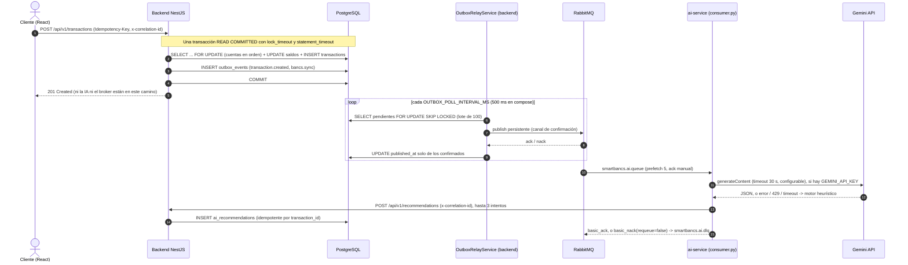

# Inteligencia artificial: implementación, despliegue y MLOps (sección 3.3 del reto)

Este documento cubre dos cosas:

1. **Integración en código (práctico, R3.3a–c).** Qué está implementado y dónde.
2. **Manejo del modelo en producción (teórico, R3.3d–f).** Ciclo de vida, monitoreo del comportamiento del modelo y gestión de recursos. Cada punto indica si está implementado o es diseño.

Convención: **Implementado** significa que existe en el repositorio (se cita archivo y función). **Diseño** significa que no está en el código del MVP.

---

## 1. Integración en código (implementado)

### 1.1. Flujo asíncrono de punta a punta

### 1.2. Lado del backend: por qué la IA no afecta la latencia de la transferencia (R3.3b, R3.3c)

- **La transferencia no llama a la IA ni publica en RabbitMQ.** `TransactionsService` ([transactions.service.ts](../backend/src/modules/transactions/transactions.service.ts)) solo recibe por inyección `DataSource`, el repositorio, `MetricsService`, el logger y `ConfigService`. No tiene cliente de RabbitMQ ni de IA. En `executeTransfer`, los eventos se insertan en `outbox_events` antes del `COMMIT`, dentro de la misma transacción (`buildOutboxEvents`), y la respuesta sale tras el `COMMIT`.
- **Evidencia automatizada:**
  - La prueba unitaria [transactions.service.spec.ts](../backend/src/modules/transactions/transactions.service.spec.ts) verifica que los eventos de IA y Bancs se insertan en el outbox antes del `COMMIT`.
  - Las pruebas de integración ([concurrency.int-spec.ts](../backend/test/concurrency.int-spec.ts)) ejecutan `TransactionsService` sin ningún broker.
- **Qué no hay:** no hay una medición de carga versionada que compare la latencia con y sin IA. Se puede observar con `smartbancs_transaction_duration_seconds` y con `POST /api/v1/simulation/quincena-spike`.
- **Relay** ([outbox-relay.service.ts](../backend/src/modules/outbox/outbox-relay.service.ts), `flushBatch`/`drain`):
  - Lee con `FOR UPDATE SKIP LOCKED`, así que es seguro con varias réplicas.
  - Publica el lote por un `ConfirmChannel`.
  - Marca `published_at` solo en los mensajes que el broker confirmó (`ack`). Los demás quedan pendientes, con `attempts` incrementado y `last_error`.
  - `RabbitMQService.publishEvent` ([rabbitmq.service.ts](../backend/src/modules/rabbitmq/rabbitmq.service.ts)) resuelve `false` ante nack, error, timeout de confirmación (`RABBITMQ_CONFIRM_TIMEOUT_MS`, 5 s por defecto) o falta de conexión.
  - La reconexión al broker es indefinida, con backoff exponencial y tope de 30 s.
  - Cada mensaje lleva `eventId` (en el body y como `messageId`) y el `correlationId`.
- **Topología:**
  - Exchange topic `smartbancs.events`.
  - `smartbancs.ai.queue` (binding `transaction.created`), durable, con `x-dead-letter-exchange: smartbancs.dlx` y `x-dead-letter-routing-key: smartbancs.ai.dlq`.
  - DLQ `smartbancs.ai.dlq`.
  - El backend (`assertTopology`) y el ai-service (`declare_topology`) la declaran con los mismos argumentos. La prueba `test_topology_matches_backend_contract` lo verifica.
- **Garantía:** *at-least-once*. Si el relay publica y el `UPDATE` falla, el lote se vuelve a publicar. El backend deduplica la recomendación por `transaction_id`.

### 1.3. Microservicio de IA (`ai-service/`, R3.3a)

**Consumidor** ([consumer.py](../ai-service/consumer.py), `process_transaction_event`):

- Usa `pika.BlockingConnection`, `basic_qos(prefetch_count=5)` y ack manual. Procesa **en serie** en un hilo; para ganar paralelismo se agregan réplicas.
- Si el mensaje no es JSON válido, o le falta `data` o `data.accountNumber`, hace `basic_nack(requeue=False)` y el mensaje va a la DLQ sin reintento.
- Ejecuta la inferencia y mide su latencia (`inference_latency_ms`).
- Hace el `POST /api/v1/recommendations` al backend (`post_recommendation_with_retries`) con el header `x-correlation-id` y `metadata` que incluye `engine`, `inferenceLatencyMs` y `eventId`:
  - 2xx o 409: `basic_ack`.
  - Timeout (5 s), error de conexión o 5xx: hasta 3 intentos en total, con esperas de 0.5 s y 1 s. Las esperas usan `time.sleep` y bloquean el consumidor mientras tanto.
  - 4xx distinto de 409: sin reintento.
  - Con reintentos agotados, 4xx o una excepción inesperada: `basic_nack(requeue=False)` → `smartbancs.ai.dlq`.
- Si pierde la conexión con RabbitMQ, reconecta cada 5 s.
- **Límite actual:** la DLQ no tiene consumidor ni reproceso automático. Los mensajes se revisan y se reinyectan a mano (UI de RabbitMQ o shovel). Un reprocesador con límite de reintentos es diseño.

**Motor de inferencia** ([advisor.py](../ai-service/advisor.py), `FinancialAdvisorModel.analyze_transaction`):

- **Gemini**, si `GEMINI_API_KEY` está definida:
  - `POST https://generativelanguage.googleapis.com/v1beta/models/{GEMINI_MODEL}:generateContent`, con la key en el header `x-goog-api-key`.
  - `GEMINI_MODEL` vale por defecto `gemini-3.6-flash` (también en [docker-compose.yml](../docker-compose.yml) y [.env.example](../.env.example)).
  - La petición lleva `systemInstruction` y `generationConfig` con `responseMimeType: "application/json"`, `temperature: 0.2`, `maxOutputTokens: 2048` y `thinkingConfig.thinkingBudget: 0` (si el modelo rechaza `thinkingConfig`, se reintenta una vez sin él). Timeout HTTP: 30 s por defecto (`GEMINI_TIMEOUT_SECONDS`).
- **Parseo** (`_clean_and_parse_json`): quita los delimitadores de markdown; si falla, extrae el primer bloque `{...}` con una expresión regular.
- **Validación del contrato** (`_validate_gemini_result`):
  - `type` debe pertenecer al enum de PostgreSQL y `message` no puede estar vacío.
  - `title` se recorta a 150 caracteres (tamaño de la columna) y `confidenceScore` se acota a [0, 1].
  - Si la respuesta no cumple, se usa el fallback.
- **Motor heurístico local** (`_heuristic_rule_fallback`): reglas deterministas por monto, categoría y proporción del saldo (umbrales explícitos al inicio de `advisor.py`), sin red. Solo afirma datos calculados de la transacción; su `confidenceScore` es un valor fijo (0.5), no una probabilidad calibrada, y `metadata.rule` indica qué regla se aplicó. Se usa cuando no hay key y cuando Gemini responde con error HTTP, 429, timeout, JSON inválido o un contrato inválido.
- Cada recomendación lleva `engine`: el nombre del modelo de Gemini o `heuristic-fallback`. Es la fuente de verdad de qué motor respondió.
- **Coste por evento con Gemini degradado:** no hay circuit breaker. Si Gemini está caído o lento, cada evento puede esperar hasta 30 s antes de caer al fallback, y eso limita el ritmo del consumidor. El circuit breaker es diseño (sección 2.4).

**Endpoints** ([main.py](../ai-service/main.py)):

- `GET /health`:
  - `status` vale `UP` o `DEGRADED` (este último si el hilo consumidor no está conectado a RabbitMQ).
  - Devuelve `geminiApiKeyConfigured`, `configuredPrimaryEngine`, los contadores de inferencias (total, Gemini, fallback) y el estado del consumidor (`connected`, `lastMessageAt`, `messagesAcked`, `messagesDeadLettered`).
- `GET /model-info`:
  - `modelVersion: "v2.5.0-gemini-hybrid"`, `serviceVersion: "2.5.0"`, motor primario y de fallback, timeout, categorías, tipos, colas y contadores.
- `POST /predict-recommendation`: inferencia síncrona bajo demanda, para pruebas. El backend no lo usa.

**Backend receptor** ([recommendations.service.ts](../backend/src/modules/recommendations/recommendations.service.ts), `create`):

- Observa `smartbancs_ai_recommendation_duration_seconds{engine}` a partir de `metadata.inferenceLatencyMs`.
- Deduplica por `transaction_id`: comprueba antes de insertar, tiene el índice único `uq_ai_recs_transaction` y, ante `23505`, devuelve la recomendación existente.
- **Limitación:** el endpoint no tiene DTO de validación ni autenticación (ver [DOCUMENTO_TECNICO.md](DOCUMENTO_TECNICO.md) §1.4).

**Aislamiento:** proceso y contenedor propios (`python:3.11-slim`, un proceso `uvicorn`). La inferencia no comparte event loop ni memoria con el backend. **No hay límites de CPU ni de memoria declarados** en `docker-compose.yml`.

### 1.4. Cómo verificar la API key de Gemini

1. Copiar `.env.example` a `.env` en la raíz y definir `GEMINI_API_KEY`. `GEMINI_MODEL` ya viene en `gemini-3.6-flash`. Sin key, todo funciona con el motor heurístico.
2. Ejecutar `python ai-service/scripts/check_gemini.py` desde la raíz, con las dependencias de `ai-service/requirements.txt` instaladas. El script ([check_gemini.py](../ai-service/scripts/check_gemini.py)):
   - Carga `.env`.
   - Imprime el modelo y **solo la longitud** de la key.
   - Hace una inferencia real con `advisor._call_gemini_api`.
   - Imprime `OK: respondió Gemini en N ms` con `engine`, `type`, `title` y `message`, o termina con `FALLO` y el motivo en el log `[GEMINI-API]`.
3. **Con el sistema levantado**, hay tres comprobaciones:
   - `GET http://localhost:8000/health` debe mostrar `geminiApiKeyConfigured: true` y el contador `geminiInferences` debe crecer.
   - Cada recomendación guardada trae `metadata.engine`.
   - En Prometheus, la serie `smartbancs_ai_recommendation_duration_seconds_count{engine="gemini"}` debe crecer.

### 1.5. Observabilidad de la IA (implementado)

- **Métrica en Prometheus:** solo `smartbancs_ai_recommendation_duration_seconds{engine="gemini"|"heuristic"|"unknown"}`. La expone el **backend**, a partir de la latencia que reporta el ai-service. Cuenta también los reenvíos duplicados. Ejemplo de p95 por motor: `histogram_quantile(0.95, sum by (le, engine) (rate(smartbancs_ai_recommendation_duration_seconds_bucket[5m])))`.
- **El ai-service no expone `/metrics`** y Prometheus no lo scrapea. Sus contadores están en memoria (`/health`, `/model-info`) y se reinician con el proceso.
- **Logs** ([log_context.py](../ai-service/log_context.py)): son texto, no JSON. Cada línea que se emite mientras se procesa un evento lleva `corrId`, `txId` y `eventId`. Hay registros de la llamada a Gemini (latencia, 429, timeout, respuesta inválida), del uso del fallback, del POST al backend y de los envíos a la DLQ.
- **Pruebas** ([test_consumer.py](../ai-service/tests/test_consumer.py) y [test_confidence.py](../ai-service/tests/test_confidence.py), 20 pruebas con `pytest`):
  - ack con 2xx y con 409.
  - Reintentos ante 503.
  - DLQ tras 3 fallos, ante 4xx y ante un mensaje inválido.
  - Payload y header de correlación.
  - Contexto de logs.
  - Contrato de topología.
  - Fallback ante un `type` inválido y ante timeout de Gemini.
  - `/model-info` sin valores inventados.

---

## 2. Manejo del modelo en producción (R3.3d–f)

**Punto de partida.** SmartBancs **no entrena un modelo**: consume un LLM alojado (Gemini) y tiene un motor de reglas como respaldo. Por eso no hay reentrenamiento ni *data drift* en el sentido clásico de un modelo entrenado, donde las features de producción se alejan de las de entrenamiento. Lo que sí cambia con el tiempo son los datos que se le envían al modelo, el modelo que ofrece el proveedor y la calidad de sus respuestas. Eso es lo que se gestiona.

### 2.1. Ciclo de vida y alimentación con datos nuevos (R3.3d)

Con un LLM alojado, "alimentar el modelo con datos nuevos" significa darle en cada llamada el contexto de la transacción, no reentrenarlo:

1. **Datos por inferencia (implementado).** Cada evento `transaction.created` lleva monto, categoría, saldo y descripción. El prompt se arma con esos datos en cada llamada ([advisor.py](../ai-service/advisor.py), `_call_gemini_api`).
2. **Más contexto (diseño).** Agregar al prompt un resumen del comportamiento reciente del cliente, como el gasto por categoría en los últimos 30 días, calculado a partir de `transactions` o de la salida del [ETL](../etl-bancs/etl_bancs_processor.py), sin enviar identificadores personales.
3. **Versionado de lo que define el comportamiento.** El identificador del modelo (`GEMINI_MODEL`, variable de entorno), el prompt, la instrucción de sistema, las reglas de respaldo y el esquema de salida se versionan en el repositorio, y cada recomendación guarda en `metadata.engine` qué modelo la generó.
4. **Cambio de versión del proveedor (caso real de este proyecto).** Google retiró `gemini-2.5-flash` para usuarios nuevos: la API empezó a responder 404 y todas las recomendaciones cayeron al motor de reglas. El servicio siguió funcionando, pero la señal de que algo cambió fue el aumento de `engine="heuristic"`. Un cambio de modelo se trata como un despliegue: se prueba con `ai-service/scripts/check_gemini.py` y con un conjunto de transacciones de referencia antes de cambiar `GEMINI_MODEL`.

### 2.2. Monitoreo del comportamiento del modelo (R3.3e)

El reto pide monitorear el *data drift*. Para un LLM consumido por API se monitorean los datos de entrada, la salida y la salud del proveedor:

| Señal | Qué detecta | Estado |
|---|---|---|
| Proporción `engine="heuristic"` frente al modelo de Gemini (`smartbancs_ai_recommendation_duration_seconds{engine}` y contadores de `/health`) | Gemini no responde, cambió de versión, alcanzó la cuota o devuelve JSON inválido | Implementado |
| Latencia de inferencia por motor (la misma métrica) | Degradación del proveedor | Implementado |
| Mensajes en `smartbancs.ai.dlq` (`/health`: `messagesDeadLettered`) | Fallos del flujo de persistencia | Implementado |
| Distribución de datos de entrada: categorías y rangos de monto del último día frente a una semana de referencia | Que el modelo reciba un tipo de transacción distinto del que se probó (por ejemplo, en quincena) | Diseño |
| Distribución de los tipos de recomendación generados | Que el modelo empiece a responder distinto ante datos parecidos | Diseño |
| Muestreo de recomendaciones para revisión humana | Calidad y tono de los mensajes al cliente | Diseño |

Las comparaciones de distribución se calcularían offline sobre `transactions` y `ai_recommendations`, nunca en el camino del consumidor. La acción ante un cambio es revisar el prompt o las reglas, o fijar otra versión del modelo, siempre probándolo antes (sección 2.1).

### 2.3. Confianza baja: operaciones que el cliente debe confirmar

`confidenceScore` no es la calidad del consejo sino **qué tan seguro está el modelo de haber interpretado la transacción**. El prompt le da criterios explícitos, en vez de un valor de ejemplo que el modelo copiaría:

| Rango | Cuándo |
|---|---|
| 0.85 a 1.0 | Monto coherente con la categoría y descripción clara |
| 0.6 a 0.85 | Datos coherentes pero con poco contexto (descripción genérica) |
| Menos de 0.6 | Datos ambiguos o contradictorios: monto desproporcionado para la categoría (p. ej. más de $1.000 en alimentación), monto alto sin descripción o transacción que consume más del 50 % del saldo previo |

Que la IA no logre interpretar una operación es en sí una señal de que la operación es atípica. Por eso, por debajo de 0.6 (`LOW_CONFIDENCE_THRESHOLD` en [advisor.py](../ai-service/advisor.py)):

- **Implementado:** la recomendación pide al cliente confirmar si reconoce la operación, lleva `metadata.needsClientConfirmation = true` y `metadata.confidenceReason`, y la UI la resalta como "Operación atípica: requiere confirmación del cliente". La regla de alto monto del motor de respaldo también la marca. Si el modelo no informa confianza, no se asume alta (0.5).
- **Diseño:** el backend escribe un evento `recommendation.confirmation_required` en el outbox y un servicio de notificaciones separado envía el correo o SMS al cliente ("¿Reconoces esta transacción?"). Es el mismo patrón que Bancs, sin tocar el camino de la transferencia.

La confianza la estima el propio modelo y no es una probabilidad calibrada. En producción, la decisión de notificar se combinaría con reglas objetivas (monto contra categoría, proporción del saldo, cuenta destino nueva) y se ajustaría con la tasa de confirmaciones reales.

### 2.4. Gestión del consumo de recursos (R3.3f)

**Implementado:**

- Contenedor y proceso separados del backend.
- `prefetch_count=5`, que acota los mensajes en vuelo por consumidor.
- Timeout de 30 s (configurable) a Gemini y de 5 s al backend.
- `maxOutputTokens: 2048` y `thinkingBudget: 0`, que acotan tokens y costo por llamada.
- Fallback local ante 429, sin reintentar contra Gemini.
- Cola durable como amortiguador: un pico de transferencias se convierte en backlog y no en carga simultánea.

**En Google Cloud:** Cloud Run fija 1 vCPU y 512 MiB para el ai-service, con una sola instancia ([run.tf](../infra/terraform/run.tf)).

**No implementado:** límites en docker compose, autoescalado por cola, control de cuota RPM, circuit breaker y caché.

**Diseño:**

1. **Límites por contenedor** (ya fijados en Cloud Run; en compose, `deploy.resources`). Se dimensionan midiendo el consumo real bajo la simulación de quincena, no con valores fijados de antemano.
2. **Autoescalado por cola** (KEDA sobre la profundidad de `smartbancs.ai.queue`), con un mínimo y un máximo de réplicas. El máximo lo fija la cuota de Gemini y la capacidad del backend para recibir los POST, no solo la cola.
3. **Cuota y costo de Gemini:**
   - *Token bucket* compartido (p. ej. en Redis) con el RPM contratado.
   - Circuit breaker: tras N fallos o 429 seguidos, se usa directamente el fallback durante T segundos, lo que evita pagar el timeout de Gemini por evento.
   - Presupuesto diario de tokens con alerta.
4. **Priorización:** si hay backlog, se atienden primero los eventos recientes (una recomendación vieja pierde valor) o los de alto monto (posible fraude). Los eventos viejos se pueden procesar solo con el motor heurístico.
5. **Caché** de perfiles de cliente y de respuestas para patrones repetidos (misma categoría y rango de monto), con TTL corto. Su beneficio se mide antes de adoptarla.
