# 🧠 3.3. Inteligencia Artificial: Implementación, Despliegue y MLOps

Este documento detalla en profundidad el cumplimiento de la **Sección 3.3 del Reto Técnico**:
1. **Integración en código (Práctico):** Microservicio independiente de IA y patrón asíncrono no bloqueante en el backend principal.
2. **Manejo del modelo (Teórico):** Ciclo de vida MLOps, ingesta continua de datos, monitoreo de *Data Drift* y optimización de recursos.

---

## 1. Integración en Código (Práctico)

### 1.1. Arquitectura de Desacoplamiento Asíncrono
Para cumplir con el **SLA de transferencia < 2 segundos**, el flujo transaccional crítico está 100% desacoplado del motor de IA mediante un **Event-Driven Architecture (EDA)** implementado con RabbitMQ:

```mermaid
sequenceDiagram
    autonumber
    actor Cliente as 📱 App Cliente / React
    participant API as ⚡ Backend Core (NestJS)
    participant DB as 🗄️ PostgreSQL (ACID)
    participant Broker as 📬 RabbitMQ (Topic Exchange)
    participant AI as 🧠 AI Service (Python FastAPI)

    participant Relay as 🔁 Outbox Relay (backend)

    Cliente->>API: POST /api/v1/transactions (Idempotency-Key, x-correlation-id)
    Note over API,DB: Una sola transacción ACID (READ COMMITTED + lock_timeout/statement_timeout)
    API->>DB: SELECT ... FOR UPDATE (cuentas en orden determinista)
    API->>DB: UPDATE saldos + INSERT transactions
    API->>DB: INSERT outbox_events (transaction.created, bancs.sync)
    API->>DB: COMMIT
    API-->>Cliente: HTTP 201 Created (la IA no está en el camino crítico)

    rect rgb(30, 41, 59)
    Note over Relay,Broker: Fuera del camino crítico, cada 500 ms
    Relay->>DB: SELECT pendientes FOR UPDATE SKIP LOCKED
    Relay->>Broker: publish(transaction.created, eventId)
    Relay->>DB: UPDATE published_at (solo si el broker aceptó)
    end

    Broker->>AI: Consume evento desde smartbancs.ai.queue
    AI->>AI: Inferencia (Gemini o motor heurístico local)
    AI->>API: POST /api/v1/recommendations (x-correlation-id)
    API->>DB: INSERT ai_recommendations (idempotente por transaction_id)
    AI-->>Broker: basic_ack
```



### 1.2. Demostración en el Código del Microservicio Principal (`backend`)
La transferencia no llama a la IA ni publica en RabbitMQ: escribe el evento en la tabla `outbox_events` **dentro de la misma transacción** y responde en cuanto termina el `COMMIT`. Fragmento de `backend/src/modules/transactions/transactions.service.ts`:

```typescript
await queryRunner.manager.save(Transaction, createdTx);

// TRANSACTIONAL OUTBOX: los eventos se escriben en la MISMA transacción.
// Si hay rollback no existen; si RabbitMQ está caído esperan en la tabla. No hay dual-write.
await queryRunner.manager.insert(OutboxEvent, this.buildOutboxEvents(createdTx, sourceAccount, correlationId));

await queryRunner.commitTransaction();
return createdTx; // la IA y Bancs se alimentan del outbox, fuera del camino crítico
```

El relay (`backend/src/modules/outbox/outbox-relay.service.ts`) publica en segundo plano:

```typescript
const rows = await qr.query(
  `SELECT id, event_type, payload, correlation_id FROM outbox_events
    WHERE published_at IS NULL ORDER BY created_at LIMIT $1
    FOR UPDATE SKIP LOCKED`, [this.batchSize]);

for (const row of rows) {
  const ok = await this.rabbitmqService.publishEvent(row.event_type, { eventId: row.id, ...row.payload }, row.correlation_id);
  if (!ok) break;                       // broker caído: el evento sigue pendiente, no se pierde
  await qr.query(`UPDATE outbox_events SET published_at = now() WHERE id = $1`, [row.id]);
}
```

**Por qué así y no "fire-and-forget":** publicar después del `COMMIT` sin outbox es un *dual-write*: si el proceso o RabbitMQ caen entre ambos pasos, la transferencia existe pero la IA y Bancs nunca se enteran. Con el outbox la garantía es que el evento se publica si y solo si la transacción se confirmó. La prueba `backend/test/concurrency.int-spec.ts` lo verifica con el broker caído y luego recuperado.

### 1.3. Microservicio Independiente de IA (`ai-service`): Integración Gemini + Fallback
Ubicado en [`ai-service/`](../ai-service), implementado en **Python FastAPI** con consumidor asíncrono [`consumer.py`](../ai-service/consumer.py) y motor de inferencia [`advisor.py`](../ai-service/advisor.py):
- **Consumo Real de Google Gemini API:** Mediante la variable de entorno `GEMINI_API_KEY`, invoca el modelo generativo de Google configurado en la variable `GEMINI_MODEL` con salidas estructuradas en JSON estricto (`responseMimeType: "application/json"`).
- **Parser Resiliente de Doble Capa (*Self-Healing JSON*):**  
  Implementado en `advisor.py`, asegura que las respuestas del LLM no interrumpan el flujo transaccional:
  - *Capa 1:* Sanitización y remoción de etiquetas markdown (` ```json ... ``` `).
  - *Capa 2:* Fallback extractivo mediante RegEx balanceado (`\{[\s\S]*\}`) para aislar el objeto JSON puro.
- **Motor de Fallback Heurístico Local (Zero-Downtime):** Si la clave no está configurada, o ante problemas de conectividad o límites de cuota (HTTP 429), el servicio degrada con gracia hacia el motor heurístico local, manteniendo disponibilidad al 100%.
- **Aislamiento de Recursos:** Se ejecuta en su propio runtime y contenedor Docker, evitando que el cómputo de inferencia consuma memoria o CPU del backend transaccional.
- **Worker Concurrente con Prefetch:** El consumidor `pika` utiliza `basic_qos(prefetch_count=5)` para procesar eventos a demanda sin saturar el proceso.
- **Endpoint Directo de Inferencia:** Expone `POST /predict-recommendation`, `GET /health` y `GET /model-info` para consultas sincrónicas bajo demanda y observabilidad de MLOps.

---

## 2. Manejo del Modelo en Producción (Teórico - MLOps)

### 2.1. Ciclo de Vida del Modelo (Model Lifecycle & Continuous Training)
El ciclo de vida del modelo de recomendación financiera sigue el estándar **MLOps CI/CD/CT (Continuous Integration, Continuous Delivery, Continuous Training)**:

```
+------------------+      +-------------------+      +--------------------+
| Ingesta ETL      | ---> | Feature Store     | ---> | Pipeline de        |
| (Bancs + Core)   |      | (PostgreSQL /     |      | Reentrenamiento    |
|                  |      | Feast)            |      | (Airflow / Kubeflow|
+------------------+      +-------------------+      +---------+----------+
                                                               |
+------------------+      +-------------------+                |
| Inferencia       | <--- | Model Registry    | <--------------+
| en Producción    |      | (MLflow / S3)     |
| (FastAPI Worker) |      | Versión Promovida |
+--------+---------+      +-------------------+
         |
         v
+------------------+
| Monitoreo        |
| Data Drift / PSI |
+------------------+
```

1. **Alimentación Continua con Nuevos Datos:**
   - El pipeline ETL diario ([`etl_bancs_processor.py`](../etl-bancs/etl_bancs_processor.py)) extrae las transacciones consolidadas de Bancs y SmartBancs.
   - Las transacciones son limpiadas, anonimizadas (cumplimiento regulatorio PCI-DSS y GDPR) y enriquecidas con variables de comportamiento (`logAmount`, `channelRiskScore`, frecuencia semanal).
   - Se almacenan en el **Feature Store**, permitiendo que el entrenamiento utilice datos históricos consistentes.

2. **Reentrenamiento Automatizado:**
   - Se ejecutan *training pipelines* periódicos (semanales o quincenales) evaluando modelos candidatos frente al modelo actual en producción (*Champion vs. Challenger*).
   - Métricas de validación: F1-Score en clasificación de gasto > 0.90 y tasa de falsos positivos en alertas de fraude < 0.5%.

### 2.2. Monitoreo de Data Drift y Concept Drift

En banca, el comportamiento de gasto cambia drásticamente en fechas especiales (quincenas, Black Friday, festividades). Para evitar la degradación del modelo:

1. **Métricas de Drift en Producción:**
   - **Population Stability Index (PSI):** Se compara la distribución de montos y categorías de los últimos 7 días contra la distribución base de entrenamiento.
     $$\text{PSI} = \sum \Big( (\% \text{Actual} - \% \text{Esperado}) \times \ln\big(\frac{\% \text{Actual}}{\% \text{Esperado}}\big) \Big)$$
     - $\text{PSI} < 0.10$: Distribución estable (Sin cambios requeridos).
     - $0.10 \le \text{PSI} \le 0.25$: Cambio moderado (Alerta preventiva a MLOps).
     - $\text{PSI} > 0.25$: *Significant Data Drift* $\rightarrow$ **Disparo automático de reentrenamiento**.
   - **Kolmogorov-Smirnov Test (KS Test):** Para variables continuas de montos transaccionales.

2. **Telemetría MLOps:**
   - El endpoint `/model-info` reporta en tiempo real la versión activa (`v2.4.0-smartbancs`), total de inferencias procesadas y estado del drift (`NORMAL`).

### 2.3. Gestión del Consumo de Recursos y Escalabilidad

1. **Escalado Horizontal Basado en Colas (KEDA / HPA):**
   - El microservicio `ai-service` escala réplicas de contenedores utilizando **KEDA (Kubernetes Event-driven Autoscaling)** basado en el tamaño de la cola `smartbancs.ai.queue` en RabbitMQ.
   - Si la cola supera los 500 mensajes pendientes (ej. pico de quincena), se escalan automáticamente de 2 a 8 pods de inferencia.

2. **Aislamiento de Recursos (Resource Limits):**
   - Configuración estricta en Docker/K8s:
     ```yaml
     resources:
       requests:
         memory: "256Mi"
         cpu: "250m"
       limits:
         memory: "512Mi"
         cpu: "1000m"
     ```
   - Garantiza que picos de inferencia nunca afecten la memoria o CPU de la base de datos PostgreSQL ni del backend NestJS.

3. **Inferencia Batch y Caching:**
   - Perfiles de clientes recurrentes y reglas base son cacheadas en memoria para ejecutar inferencias en **< 5 ms**, minimizando el consumo de CPU.
