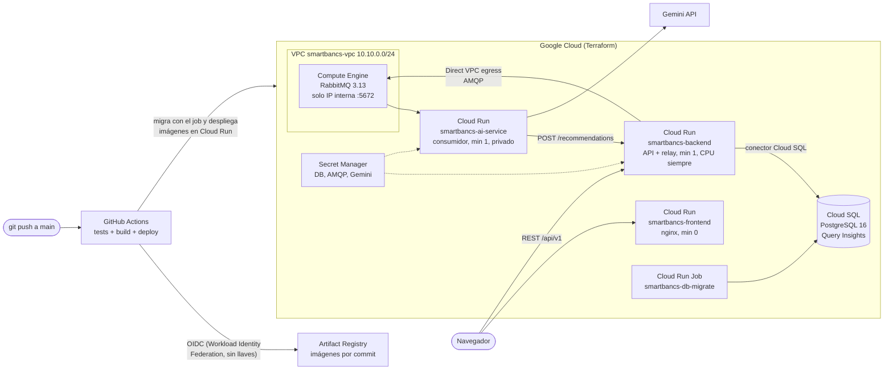

# Despliegue en Google Cloud (Terraform + GitHub Actions)

El entorno local sigue siendo `docker compose up --build`. Esta carpeta despliega la misma solución en Google Cloud:

- **Terraform** (`infra/terraform/`) crea la infraestructura.
- **GitHub Actions** (`.github/workflows/ci-cd.yml`) prueba, construye y despliega en cada push a `main`.



## Qué crea Terraform

| Recurso | Para qué | Decisión |
|---|---|---|
| Cloud Run `smartbancs-backend` | API de transferencias y relay del outbox | `min_instance_count = 1` y CPU siempre asignada: el relay y la conexión AMQP trabajan fuera de las peticiones HTTP. Varias instancias son seguras porque el relay usa `FOR UPDATE SKIP LOCKED`. |
| Cloud Run `smartbancs-ai-service` | Consumidor de RabbitMQ y Gemini | Una instancia fija con CPU siempre asignada. Sin acceso público. |
| Cloud Run `smartbancs-frontend` | SPA servida por nginx | Escala a cero. La URL del backend se incrusta al construir la imagen. |
| Cloud Run Job `smartbancs-db-migrate` | Aplica `backend/sql/*.sql` | Idempotente: si la tabla `accounts` existe, no hace nada. El pipeline lo ejecuta antes de desplegar. |
| Cloud SQL PostgreSQL 16 | Base transaccional | Acceso solo por el conector de Cloud SQL (IAM + TLS). Flags `log_lock_waits` y `log_min_duration_statement`, y Query Insights para diagnosticar el incidente de quincena. |
| VM de Compute Engine con RabbitMQ | Broker AMQP | Cloud Run solo acepta tráfico HTTP entrante, así que el broker no puede correr ahí. La VM solo acepta AMQP desde la subred; Cloud Run llega por Direct VPC egress. SSH y consola, solo por túnel de IAP. |
| Secret Manager | Contraseña de la base, URL de AMQP y API key de Gemini | Los servicios los leen como variables de entorno; no hay secretos en el código ni en el pipeline. |
| Artifact Registry | Imágenes etiquetadas con el SHA del commit | Cada despliegue es trazable a un commit. |
| Workload Identity Federation | Autenticación de GitHub Actions | Sin llaves JSON: solo el repositorio configurado obtiene credenciales, con una cuenta de servicio de permisos mínimos. |

### Dimensionamiento de conexiones

`db-f1-micro` admite unas 25 conexiones. El backend usa `DB_POOL_MAX = 8` con un máximo de 2 instancias (16 conexiones), más el job de migración. Para escalar hacia 10 000 TPS se sube el tier de Cloud SQL y se agrega PgBouncer o el pooling administrado de Cloud SQL; esa estrategia está en el documento técnico.

## Pasos

### 1. Prerrequisitos
- Proyecto de GCP con facturación habilitada.
- [gcloud](https://cloud.google.com/sdk/docs/install) y [Terraform](https://developer.hashicorp.com/terraform/install) 1.6 o superior.

```bash
gcloud auth login
gcloud auth application-default login
gcloud config set project <PROJECT_ID>
```

### 2. Crear la infraestructura
```bash
cd infra/terraform
cp terraform.tfvars.example terraform.tfvars   # completar project_id y, si se usa, gemini_api_key
terraform init
terraform apply
```
Tarda unos 15 minutos, la mayor parte en crear Cloud SQL. Los servicios quedan creados con una imagen de arranque; las imágenes reales las despliega el pipeline.

`terraform.tfvars` y el estado (`*.tfstate`) están en `.gitignore`: contienen la API key y contraseñas.

### 3. Conectar GitHub Actions
```bash
terraform output github_variables
```
Crear esas cuatro variables en GitHub, en *Settings > Secrets and variables > Actions > Variables*: `GCP_PROJECT_ID`, `GCP_REGION`, `GCP_WIF_PROVIDER` y `GCP_DEPLOYER_SA`. No son secretos: no dan acceso por sí solas.

### 4. Desplegar
Hacer push a `main` o ejecutar el workflow *CI/CD* a mano desde la pestaña *Actions*. El pipeline:

1. Corre las pruebas en paralelo: backend (tsc, unitarias y concurrencia contra un PostgreSQL de servicio), ai-service (pytest), frontend (tsc y build) y Terraform (`fmt` y `validate`).
2. Si todo pasa, construye y publica las imágenes con el SHA del commit.
3. Ejecuta el job de migración y espera a que termine.
4. Despliega backend, ai-service y frontend (este último con la URL del backend).
5. Hace un smoke test (`/api/v1/accounts`, `/metrics`, frontend) y deja las URLs en el resumen del run.

En pull requests solo corren las pruebas.

### 5. URLs
```bash
terraform output frontend_url
terraform output backend_url
```

## Operación

- **Logs:** Cloud Logging, filtrando por servicio. Los del backend salen en JSON con `correlationId`.
- **Consultas lentas y bloqueos:** Cloud SQL > Query Insights, más los logs de `log_lock_waits` y `log_min_duration_statement`.
- **Métricas de la aplicación:** `<backend_url>/metrics`, en formato Prometheus. Prometheus y Grafana corren en el entorno local. En la nube, el siguiente paso sería Google Managed Service for Prometheus.
- **Consola de RabbitMQ:** `gcloud compute start-iap-tunnel smartbancs-rabbitmq 15672 --local-host-port=localhost:15672 --zone us-central1-a` y luego http://localhost:15672 (usuario `smartbancs`; la contraseña está en el secreto `smartbancs-rabbitmq-url`).
- **Simulación de quincena:** apagada por defecto, porque mueve dinero sin autenticación en una URL pública. Para una demo: `terraform apply -var enable_simulation=true`, y volver a `false` al terminar.

## Límites conocidos (MVP)

- **Sin autenticación.** El backend y `/metrics` son públicos, adecuado solo para la demo.
- **RabbitMQ sin alta disponibilidad.** Corre en una sola VM. En producción iría un servicio administrado o un clúster.
- **Estado de Terraform local.** En un equipo iría en un bucket de GCS con bloqueo.
- **Cloud SQL zonal.** En producción, `availability_type = "REGIONAL"`.

## Costos y limpieza

Mientras esté arriba se cobra: Cloud SQL, la VM `e2-small` y las instancias mínimas de Cloud Run. Para borrar todo:
```bash
cd infra/terraform
terraform destroy
```
